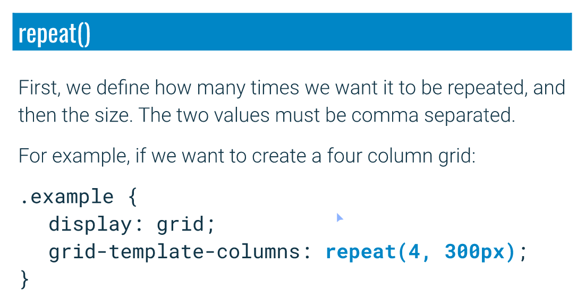
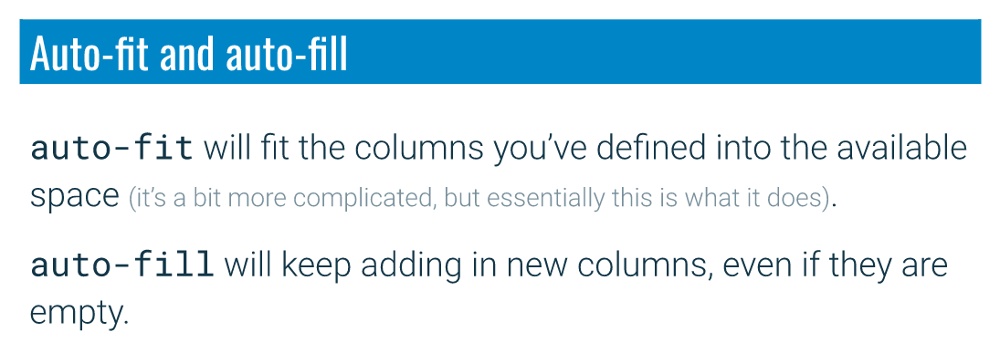

# Notes

## repeat() value



As long as the columns are of the size, we can use `repeat()`.

We can also use the size with `minmax()`.

Or even have a part of the grid using `repeat`:

```css
.selector {
  grid-template-columns: 200px repeat(3, 1fr) 200px;
}
```

## `auto-fit` and `auto-fill`



### `auto-fill` example

```css
.selector {
  grid-template-columns: repeat(auto-fill, minmax(200px, 1fr));
}
```

This will create a grid with **200px** minimum width columns to **1fr** maximum.

As long as the grid can contains 200px columns, it will add/remove columns. Otherwise, the column will flex.

But, if you look at [the example in index.html](index.html), as you shrink and grow the screen width, the columns are added or removed, with any **media queries in place**.

However, you have no more content to fill the columns added, it will look empty!

Check out the example in [index.auto-fit.vs.auto-fill.html](index.auto-fit.vs.auto-fill.html).
