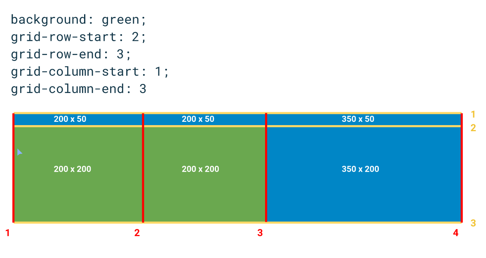

# Notes

## Columns and rows numbering

## Position a grid item

## Shorthand

### Concrete example

Before:

After:

## Overlapping or no overlapping

Grid items will not overlap:

- if

  - one grid item has a positionning with `grid-row` and `grid-column` and
  - another with just `grid-row`,
  - **it won't overlap.**

- if

  - 2 grid items have a positionning with `grid-row` and `grid-column` that explicitly overlap,
  - **it will overlap.**

  See [index.html](index.html)

## Negative counting

Here we count positively: 1, 2, ..., N from left to right or top to bottom.

But also, we can count negatively.

