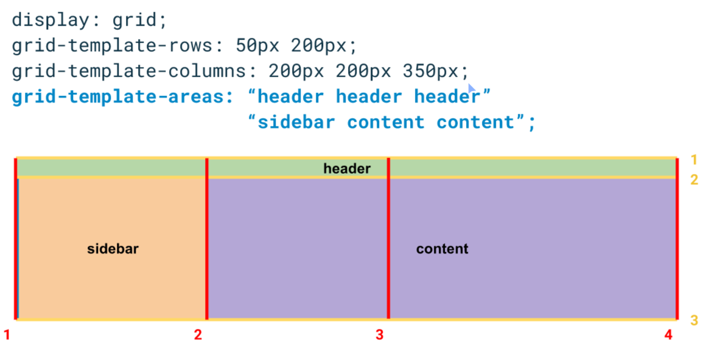

# Notes

Here is a visual example:



At all time, each area must be a "rectangle" shape area. Otherwise, the grid will be broken.

Example that is ok:

```css
.grid {
  grid-template-areas:
    "header header header header"
    ". content sidebar ." /* The dot means "have an empty cell */
    "footer footer footer footer";
}
```

Example that is ko:

```css
.grid {
  grid-template-areas:
    "header header header sidebar"
    ". content sidebar ." /* The dot means "have an empty cell */
    "footer footer footer footer";
}
```
